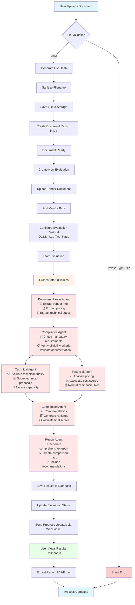

# Complete End-to-End Document Upload & Evaluation Flow

## Single Mermaid Diagram

```mermaid
flowchart TD
    %% Document Upload Phase
    A[User Uploads Document] --> B{File Validation}
    B -->|Invalid Type/Size| C[Show Error]
    B -->|Valid| D[Generate File Hash]
    D --> E[Sanitize Filename]
    E --> F[Save File to Storage]
    F --> G[Create Document Record in DB]
    G --> H[Document Ready]
    
    %% Evaluation Setup Phase
    H --> I[Create New Evaluation]
    I --> J[Upload Tender Document]
    J --> K[Add Vendor Bids]
    K --> L[Configure Evaluation Method<br/>QCBS / L1 / Two-Stage]
    L --> M[Start Evaluation]
    
    %% Multi-Agent Processing Phase
    M --> N[Orchestrator Initializes]
    N --> O[Document Parser Agent<br/>📄 Extract vendor info<br/>💰 Extract pricing<br/>🔧 Extract technical specs]
    
    O --> P[Compliance Agent<br/>✅ Check mandatory requirements<br/>📋 Verify eligibility criteria<br/>📝 Validate documentation]
    
    P --> Q[Technical Agent<br/>⚙️ Evaluate technical quality<br/>📊 Score technical proposals<br/>🎯 Assess capability]
    
    P --> R[Financial Agent<br/>💵 Analyze pricing<br/>📈 Calculate cost scores<br/>💰 Normalize financial bids]
    
    Q --> S[Comparison Agent<br/>📊 Compare all bids<br/>🏆 Generate rankings<br/>⭐ Calculate final scores]
    R --> S
    
    S --> T[Report Agent<br/>📑 Generate comprehensive report<br/>📊 Create comparison matrix<br/>📈 Include recommendations]
    
    %% Results & Completion Phase
    T --> U[Save Results to Database]
    U --> V[Update Evaluation Status]
    V --> W[Send Progress Updates via WebSocket]
    W --> X[User Views Results Dashboard]
    X --> Y[Export Report PDF/Excel]
    Y --> Z[Process Complete]
    
    C --> Z
    
    %% Styling
    style A fill:#e1f5ff
    style Z fill:#e1f5ff
    style N fill:#fff4e6
    style O fill:#ffe6e6
    style P fill:#ffe6e6
    style Q fill:#ffe6e6
    style R fill:#ffe6e6
    style S fill:#ffe6e6
    style T fill:#ffe6e6
    style X fill:#e6ffe6
    style C fill:#ffcccc
```

